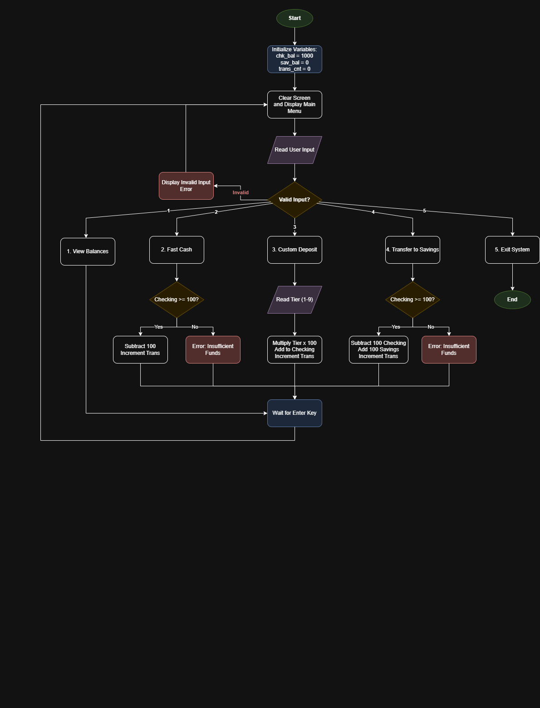

# System Architecture and Operational Flow

The **APU Global Secure Banking Simulator** is an ongoing, menu-controlled financial terminal. Its main functions entail maintaining safe storage of account balances, performing basic arithmetic transactions (making deposits, withdrawals, and transfers), providing overdraft protection through conditional validation, and repeatedly changing binary memory data into ASCII strings for printing purposes.

To ensure that the system is well-implemented, the development design allows for a continuous workflow that actively intercepts input errors and financial deficits without crashing.

## Logical Flowchart

## Execution Flow Breakdown

### 1. Start & Initialize System
The program initiates execution from the global `_start` point. It establishes its variables in the Block Started by Symbol (`.bss`) segment where immediate 32-bit double-word default values are fed into the Checking Balance (`chk_bal = 1000`), Savings Balance (`sav_bal = 0`), and Transaction Counter (`trans_cnt = 0`).

### 2. Terminal Sanitization and Menu Rendering
The primary execution loop calls a screen-clearing subroutine utilizing ANSI terminal escape sequences (`0x1B, "[2J"`). It then executes a Linux kernel interrupt (`int 0x80` via `sys_write`) to render the user interface dashboard.

### 3. Read User Input & Validation
The system captures user interaction via `sys_read` and loads the captured input byte into the primary accumulator register (`AL`). It performs sequential `CMP` instructions to compare the input against ASCII constants '1' to '5'. 
* The `JE` (Jump if Equal) instruction forces the program to jump to the appropriate financial subroutine if the hardware Zero Flag is triggered (`ZF = 1`). 
* An unconditional `JMP` acts as a safeguard, routing unrecognized bytes to an error handler.

### 4. Financial Operations
* **View Balances:** Retrieves raw 32-bit binary integers from memory and invokes the division loop to convert them into readable ASCII strings.
* **Fast Cash & Transfers:** Verifies account liquidity by comparing `[chk_bal]` against the requested amount. The `JL` (Jump if Less) instruction detects the Sign Flag (`SF = 1`) and diverts execution to block deficits. If verified, it executes `SUB` and `ADD` instructions to move funds.
* **Custom Deposit:** Strips ASCII encoding by subtracting hexadecimal zero (`sub al, '0'`), multiplies the raw integer by 100 using the Integer Multiply (`IMUL`) instruction, and credits the ledger.

### 5. Session Termination
When exit is requested, the application breaks from the primary loop, flushes active registers, and invokes Linux kernel syscall 1 (`sys_exit`) with a return code of 0, safely restoring control to the host operating system.
